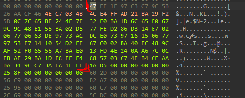

# Reverse Engineering in Python - Public Key Deobfuscation in Brawl Stars 

This guide demonstrates the process of deobfuscating the server's public key using pure Python.

## Disclaimer
This project is intended for educational and research purposes only. The author does not endorse, encourage, or assume responsibility for any misuse or violation of terms of service.

By using this project, you agree that you are solely responsible for ensuring compliance with applicable laws. Any unauthorized use is strictly prohibited and done at your own risk.

## Method: Extracting the Obfuscated Key

1.In IDA Pro, search for the sequence of bytes:
```
1A D5 00 00 00 00 00 00
```

2. These bytes always appear right after the obfuscated key. Extract the key from the surrounding data.



3. The obfuscated key in this example:
```
47FF1E97C3C79C5B26AACF464EC7034B4CE4FFAD21BA29F25D0C7C65BE244E7E32E0BA1D6C65F0679C9C48E155BA02D577FED286D314E70206770663DE9773ACDCE07397161506779753E7141054D2FE67C002BA40EC489CAF52F06555A7BAE013FD4E240AA67C0CFBAF29BA1DE8FFE4885703C74EB4CFAABA349CC73AFA1EFF
```

4. Copy the obfuscated key.
5. Use this key in your code, replacing the value of `server_public_key_str`.


## Implementation
```python
server_public_key_str = "47FF1E97C3C79C5B26AACF464EC7034B4CE4FFAD21BA29F25D0C7C65BE244E7E32E0BA1D6C65F0679C9C48E155BA02D577FED286D314E70206770663DE9773ACDCE07397161506779753E7141054D2FE67C002BA40EC489CAF52F06555A7BAE013FD4E240AA67C0CFBAF29BA1DE8FFE4885703C74EB4CFAABA349CC73AFA1EFF"

def byte_array_to_hex(byte_array):
    return ''.join(f'{b:02x}'.upper() for b in byte_array)

def string_to_hex(hex_string):
    if len(hex_string) % 2 != 0:
        raise ValueError("Hex string must have an even length.")
    return bytes.fromhex(hex_string)

def load_server_public_key(server_public_key_obf):
    server_public_key = bytearray(32)
    
    server_public_key_obf_shorts = []
    for i in range(0, len(server_public_key_obf), 2):
        value = (server_public_key_obf[i + 1] << 8) | server_public_key_obf[i]
        server_public_key_obf_shorts.append(value)
    
    for i in range(16):
        v16 = server_public_key_obf_shorts[31 - 2 * i + 32]
        v17 = (server_public_key_obf_shorts[2 * i + 1] ^ v16) | (v16 ^ server_public_key_obf_shorts[2 * i])

        shift = 11 - (i & 7)
        if shift > 0:
            rotated = ((v17 << shift) | (v17 >> (16 - shift))) & 0xFFFF
        else:
            shift = abs(shift)
            rotated = ((v17 >> shift) | (v17 << (16 - shift))) & 0xFFFF
            
        result = rotated ^ server_public_key_obf_shorts[31 - i + 32]
        
        server_public_key[2 * i] = result & 0xFF
        server_public_key[2 * i + 1] = (result >> 8) & 0xFF
    
    return server_public_key

def main():
    server_public_key_obf = string_to_hex(server_public_key_str)
    server_public_key = load_server_public_key(server_public_key_obf)
    print(f"Result: {byte_array_to_hex(server_public_key)}")

if __name__ == "__main__":
    main()
```

## Note
This code implements a publicly known and documented algorithm. The Python implementation serves as an educational reference for reverse engineering studies.

## Credits
This python algorithm was adapted based on the original code by DemirCnq
Link: https://github.com/DemirCnq/Key-Deobfuscator


